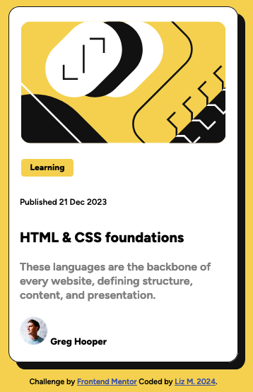

# Frontend Mentor - Blog preview card solution

This is a solution to the [Blog preview card challenge on Frontend Mentor](https://www.frontendmentor.io/challenges/blog-preview-card-ckPaj01IcS). Frontend Mentor challenges help you improve your coding skills by building realistic projects. 

## Table of contents

- [Frontend Mentor - Blog preview card solution](#frontend-mentor---blog-preview-card-solution)
  - [Table of contents](#table-of-contents)
  - [Overview](#overview)
    - [The challenge](#the-challenge)
    - [Screenshot](#screenshot)
    - [Links](#links)
    - [Built with](#built-with)
    - [What I learned](#what-i-learned)
    - [Goals](#goals)
    - [Useful resources](#useful-resources)
  - [Author](#author)

## Overview

### The challenge

Users should be able to:

- See hover and focus states for all interactive elements on the page

### Screenshot

### Links

- Solution URL: [Here](https://martinsliz.github.io/blog-preview-card-main/)

### Built with

- HTML
- CSS
  

### What I learned

Gained more insight about using rem vs px for font sizing. I am still gaining more knowledge of using CSS display concepts. For instance I still could not grasp the correct display syntax to get the "Greg Hooper" name to line up exactly beside the avatar. I'd love to get any suggestions to tweak that.

### Goals

To get even better at manipulating flex box, grid, and other properties to help future challenges and projects.

### Useful resources

- [W3 Schools](https://www.w3schools.com/) - When I want a user-friendly explanation of CSS concepts, this is where I'll head first.

## Author

- Github - [martinsliz](https://github.com/martinsliz)
- LinkedIn - [in/lizmartinsli/](https://www.linkedin.com/in/lizmartinsli/)
- Frontend Mentor - [@martinsliz](https://www.frontendmentor.io/profile/martinsliz)
